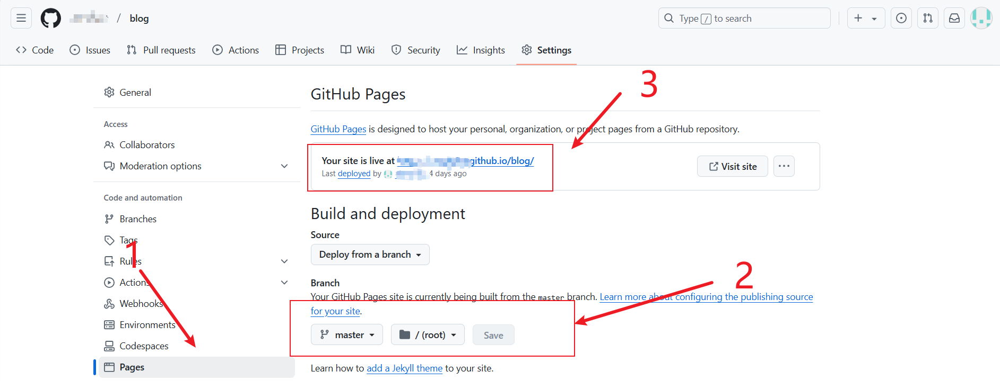

# 第一阶段

**推荐学习路线** [B 站 objtube 的卢克儿前端学习路线](https://objtube.github.io/front-end-roadmap/#/)


## HTML

`菜鸟教程` HTML 篇认真做笔记+练习走下来，HTML5 看看就行

## CSS

css 更看重理解运用。

建议学习方法：

- 1.首先跟着 `菜鸟教程` 看完理论

- 2.直接大量练习，特别经典案例

::: tip
CSS 一定要大量练习！！！
:::

## JaveScript

打好 JS `基础` 很重要。

建议学习方法：

- 根好该视频打基础 [JavaScript 前端课程-dom-bom-js-es6 新语法-jQuery-数据可视化 echarts 黑马 pink 老师前端入门基础视频教程(500 多集)持续](https://www.bilibili.com/video/BV1Sy4y1C7ha/?p=436&share_source=copy_web&vd_source=556068448e3e9981758eda02d5e5001b)

- ES6 很重要，可以看这个视频好好学习 [尚硅谷 Web 前端 ES6 教程，涵盖 ES6-ES11](https://www.bilibili.com/video/BV1uK411H7on/?share_source=copy_web&vd_source=556068448e3e9981758eda02d5e5001b)

## 版本管理根据 Git

**1.下载 git 相关需要**

直接浏览器搜索，有很多详细教程

**2.注册 GitHub 账户**

同上，注意下 GitHub 国内有时候访问不了问题

**3.学会简单的 git 使用**

- 在 GitHub 上创建项目后，下面会有一系列提示命令，跟着敲一遍体验一下

- 然后找博客学习具体用法

```nginx
// 简单的一些命令，建议初学认真学习这些，其他的了解一下或者不看都行

git init
git clone 一般为https下复制  //刚开始，一般用该命令从Git仓库拷贝项目

// 写完代码想提交时，一般会用已下命令
git add .  // 添加文件到缓存命令
git commit -m "填写内容"  // 提交命令

// 很常用的推拉代码命令
git push
git pull
```

**4.搭建静态博客站点**

提供两种简单的方法：

- `vuepress` + `GitHub Pages`

- `vuepress` + ` Netlify`

**vuepress 使用方法：**

1、vuepress 建议直接跟着官方文档这里开始 [快速上手 | VuePress](https://vuepress.vuejs.org/zh/guide/getting-started.html#创建项目)
2、建议用 手动创建 方式，pnpm 管理

**GitHub Pages 部署：**

1.在 GitHub 上上传你的项目

2.在项目界面点击 `Setting`


3.根据图下步骤，点击 1 处；填写 2 处，填好后点击 Save；等待几秒，或者直接浏览器刷新，3 处就会处理，你的博客地址就在 3 处


**Netlify 部署：**

[部署 | VuePress](https://vuepress.vuejs.org/zh/guide/deployment.html#netlify)

乖乖跟着官网 Netlify 即可
