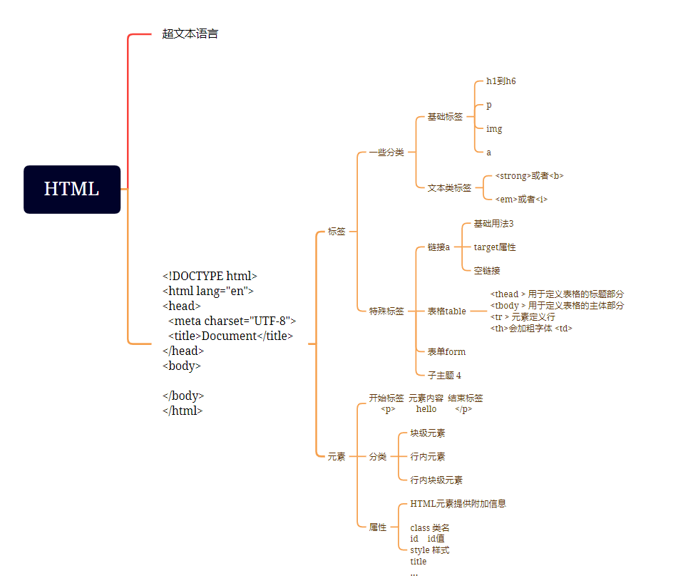
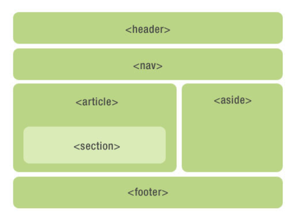

# HTML

**推荐学习链接** [菜鸟教程](https://www.runoob.com/html)

**HTML 速查列表 [HTML 速查列表 | 菜鸟教程](https://www.runoob.com/html/html-quicklist.html)**

**思维导图**



## 01.HTML 简介

**1、HTML 超文本语言**

**2、结构：**

1.声明

```
<!DOCTYPE html> 声明为 HTML5 文档
```

```
<html></html>根元素 包裹下面2个部分
```

2.头部元素

```
<head>  </head>
里面title标签内 为网页标题
<meta charset="utf-8"> 定义网页编码格式为 utf-8 避免乱码
```

3.可见内容

```
<body>  </body>
```

**3、HTML 标签**

一般为<></>这种形式出现

```
也有少数特殊</>这种形式 空元素
<hr/>    横线隔开
<br/>    换行
<input/> 输入框
```

**4、HTML 元素**

```
HTML元素 包含 HTML标签

eg：<p>hello</p>
标签：p标签
元素：p标签 text元素（hello）
```

## 02.HTML 基础

**标题**

```
h1到h6都是
<h1></h1>  ... <h6></h6>
h1的字体大小最大
```

**段落**

```
<p></p>
```

**链接**

```
<a></a>  里面一般有href属性 跳转地址
<a href="https://www.runoob.com">菜鸟教程<a/>  点击跳转菜鸟教程

特殊情况：
<a href="#id">跳转该id位置<a/>  点击跳转该id位置
```

**图片**

```
</img> 里面一般有src属性 图片地址


特殊：
width和height是它的属性
一般元素的宽高为样式
<div style="width:100px;"></div>
```

## 03.HTML 元素

```
开始标签  元素内容  结束标签
  <p>     hello    </p>
```

**嵌套元素**

```
<body>
  <p>
  </p>
</body>

body标签里面嵌套了p标签
```

## 04.HTML 属性

**为 HTML 元素提供附加信息**

```
属性大致为：
class 类名
id    id值
style 样式
title 描述了元素的额外信息 (作为工具条使用)  img图片里面 图片不能显示时 会显示titl
```

**常用属性**：

```
   alt提供图片的替代文本

<button title="Click me">Submit</button>  title鼠标悬停时显示

<a href="https://www.example.com" target="_blank" rel="noopener">Open in new tab</a>
指定链接的打开方式（如 _blank 在新窗口中打开）
```

## 05.HTML 文本格式化

```
常用
加粗 <strong>或者<b>
斜体 <em>或者<i>
```

## 06.HTML 链接

**基本用法**

```
<a href="/index.html">本文本</a> 跳转本地文件页面

<a href="https://www.runoob.com">菜鸟教程<a/>  点击跳转菜鸟教程

<a href="#id">跳转该id位置<a/>  点击跳转该id位置
```

**target 属性**

```
_self: 在当前窗口或标签页中打开链接（默认）。
_blank: 在新窗口或新标签页中打开链接。
```

**空链接**

```
href="#"	导航到页面顶部	是	占位符，捕获点击事件
href="javascript:void(0)"	阻止默认行为，不刷新页面	否	阻止跳转，配合 JS 使用
href=""	刷新当前页面	是	需要页面刷新时
```

## 07.HTML 表格

```html
<table border="1">
  <thead>
    <tr>
      <th>标1</th>
      <th>标2</th>
    </tr>
  </thead>
  <tbody>
    <tr>
      <td>11</td>
      <td>12</td>
    </tr>
    <tr>
      <td>21</td>
      <td>22</td>
    </tr>
  </tbody>
</table>
```

```
<thead > 用于定义表格的标题部分
<tbody > 用于定义表格的主体部分
<tr > 元素定义行
<th>会加粗字体 <td>
```

## 08.HTML 区块

HTML 元素被分为**块级元素**、**行内元素** 、**行内块级元素**

```
块级元素：
1.独占一行
2.有宽高
3.默认宽度100%

行内元素：
1.非独占
2.无宽高 外边距（margin）和内边距（padding）仅设置左右方向有效 上下无效 设置行高有效，等同于给父级元素设置行高
3.宽度就是它包含的文字或图片的宽度，不可改变
4.行内元素中不能放块级元素，a 链接里面不能再放链接
<a> <b>   <span>

行内块级元素：
1.非独占
2.有宽高
3.会有空白缝隙，设置它上一级的 font-size 为 0，才会消除间隙
<button> <input>   <textarea> <select> 
```

## 09.HTML 表单

**大致结构**

```
<form action="" method="post">
Username: <input type="text" name="user"><br>
Password: <input type="password" name="password">
<input type="submit" value="提交">
</form>
```

**属性**

```
action 属性定义了表单数据提交的目标 URL
method 属性定义了提交数据的 HTTP 方法 (默认get)
```

## 10.HTML 框架

可以在同一个浏览器窗口中**显示不止一个页面**

**语法**

```
<iframe src="URL"></iframe>
```

# HTML5

HTML5 是 HTML 最新的修订版本，2014 年 10 月由万维网联盟（**W3C**）完成标准制定。

HTML5 的设计目的是为了在**移动设备上支持多媒体**。

## 11.HTML5 图形绘制

Canvas 用于图形的绘制，通过脚本 (通常是 JavaScript)来完成

```
SVG 是一种使用 XML 描述 2D 图形的语言。

Canvas 通过 JavaScript 来绘制 2D 图形
```

## 12.HTML5 语义元素

```
<header>
<nav>
<section>
<article>
<aside>
<footer>
```


