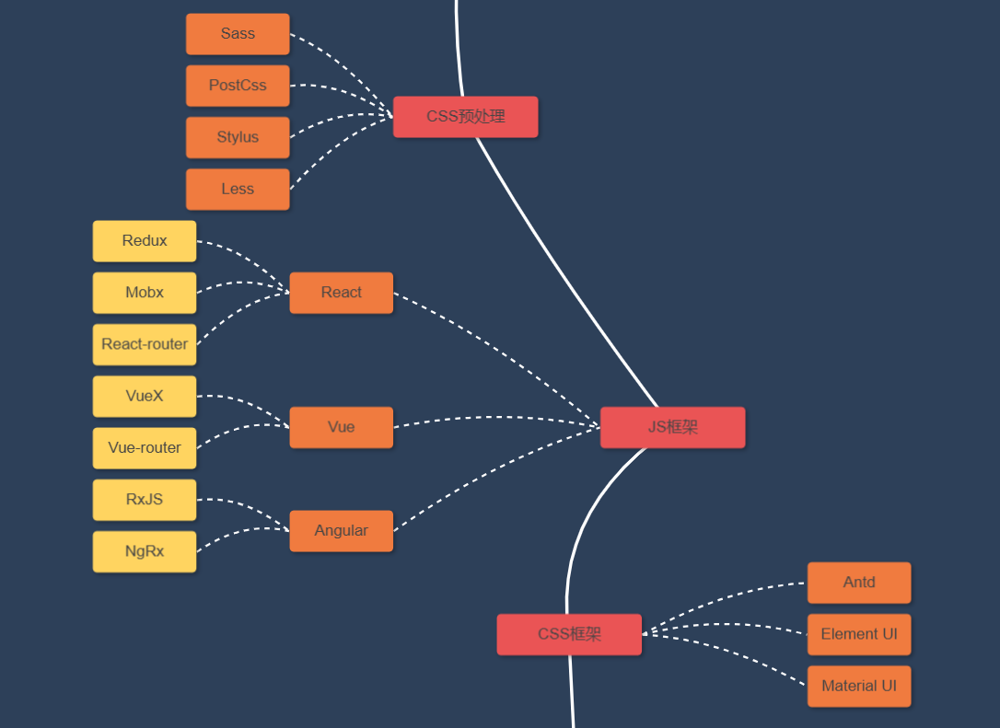

# 第二阶段

**推荐学习路线** [B 站 objtube 的卢克儿前端学习路线](https://objtube.github.io/front-end-roadmap/#/)

## 计算机网络

暂缓

## 操作系统

暂缓

## CSS

### 预处理

以下学习以 `Less` 为主

 [Less 快速入门 | Less.js 中文文档 - Less 中文网](https://less.bootcss.com/) 

学习视频：[2024码路Less和Sass | Less | Sass | CSS预处理器]( https://www.bilibili.com/video/BV1vC41137TA/?share_source=copy_web&vd_source=556068448e3e9981758eda02d5e5001b)

### 框架

Element Plus：一般在 Vue 框架使用 [一个 Vue 3 UI 框架 | Element Plus](https://element-plus.org/zh-CN/)

Ant Design：一般在 React 框架使用 [Ant Design - 一套企业级 UI 设计语言和 React 组件库](https://ant.design/index-cn/)

## JS 框架

初学框架，建议先学  `Vue`  会比  `React`  简单一些

### Vue

学习视频：[尚硅谷Vue3入门到实战，最新版vue3+TypeScript前端开发教程]( https://www.bilibili.com/video/BV1Za4y1r7KE/?share_source=copy_web&vd_source=556068448e3e9981758eda02d5e5001b)

### React

React框架，建议多了解它的**Hooks**

学习视频：[尚硅谷Vue3入门到实战，最新版vue3+TypeScript前端开发教程]( https://www.bilibili.com/video/BV1Za4y1r7KE/?share_source=copy_web&vd_source=556068448e3e9981758eda02d5e5001b)